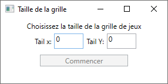
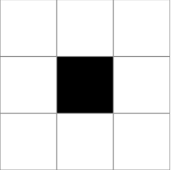
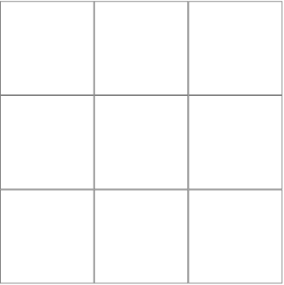
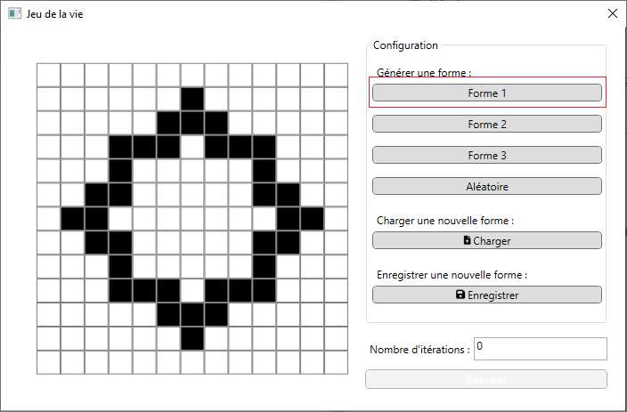
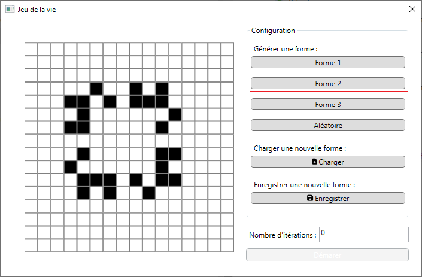
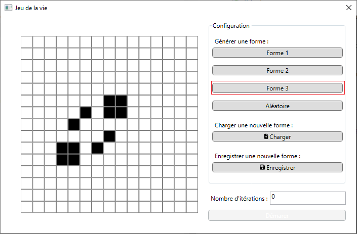
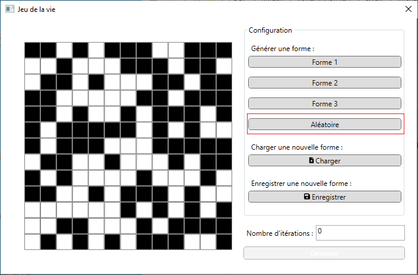
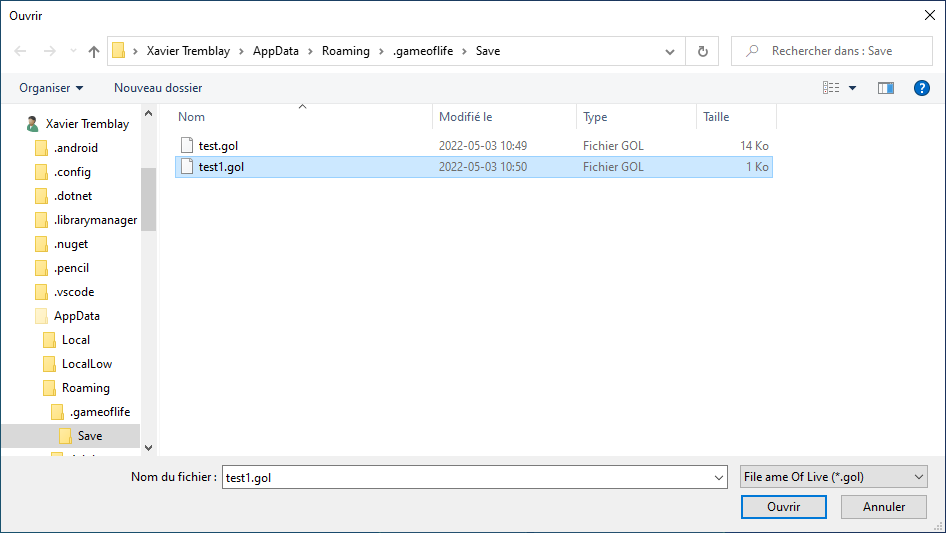
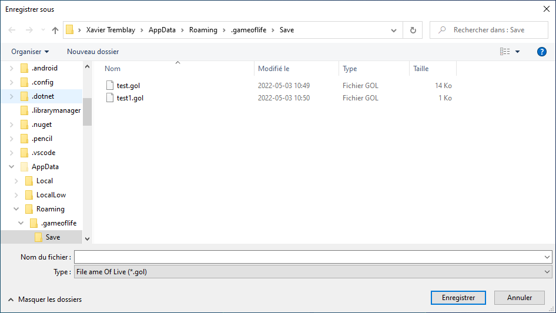
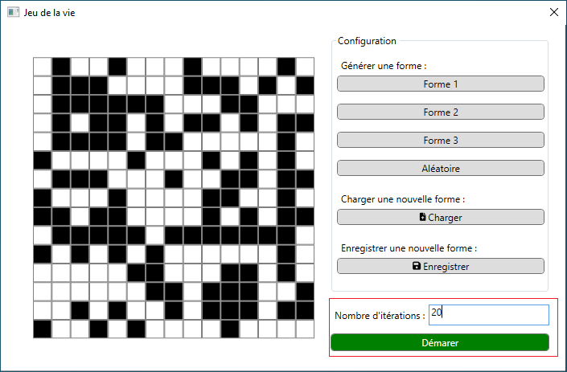

# Game of life

## Description

Jeux de la vie de  effectuer en c# en respectant les règle du jeux de Jau Hall Connaway

Les tecnique que j'ai apris dans ce projet sont l'utilisation de canevas

## Installation

Aller dans les relase du projet : [Lien](https://github.com/kwidz/XavierSoloProject/releases/tag/v1.0)

1. Dans la releases telecharger `Game.of.life.exe`
2. Executer le programme

3. Choisir la langue dasn le menu déroulant et clicker `ok`

4. Choisir la destination pour instaler l'application avec le bouton `parcourir...` puis `Suivant`

5. Choisisez si vous voulez un racoursis sur le bureaux avec la case `Créer une icône sur le Bureau` puis `Suivant`

6. Click sur le bouon `Installer`

7. Cocher la case ` Exécuter Game Of life` si vous voulez lancer le jeux puis `Terminer`

## Utilisation

### Lancement

 Aux lancement l'application affiche cette fenêtre
 
 
 Pour lancer une partir entrer de nombre dans les zone de texte (Conseiller inferrieure a 50) Puis `Commencer`
 
### Principe de fonctionnement

 Les cellule ont deux état
 
 - Vivant 
 - Morte 

Pour Modifier l'état de la celule un simple click sufit

### Bouton de l'interface

 1. Forme 1 en appuillant sur ce bouton la forme suivante apparait
 

 2. Forme 2 en appuillant sur ce bouton la forme suivante apparait
 

 3. Forme 3 en appuillant sur ce bouton la forme suivante apparait
 

 4. Alléatoire en appuillant sur ce bouton une forme alléatorie vas ètre generer
  

 5. Charger en appuillant sur ce bouton un explorateur de fichier s'ouvre et vous pouvez choisire une forme qui seras charger
      Chargement 
      
     Forme
      

 6. Enregistrer en appuillant sur ce bouton un explorateur de fichier s'ouvre et vous pouvez choisire une forme qui seras Enregistrer
      Chargement 
      
     Forme
      

 7. Demmarer ce bouton permet de commencer des ittération du jeux de la vie avec les cellule morte et vivante
    

    
## Fonctionnalité

- Taille de grille paramétrable aux lancement du projet
- Click sur des cellule pour modifier l'état
- Exporter des forme
- Importer des forme
- Charger des forme constant
- Démarrer le jeu